# NexusERP Architecture Specification

## Intelligent Demand-to-Delivery Manufacturing ERP

---

# 1. System Architecture

NexusERP follows a layered architecture that separates presentation, application logic, domain services, persistence, and database storage.

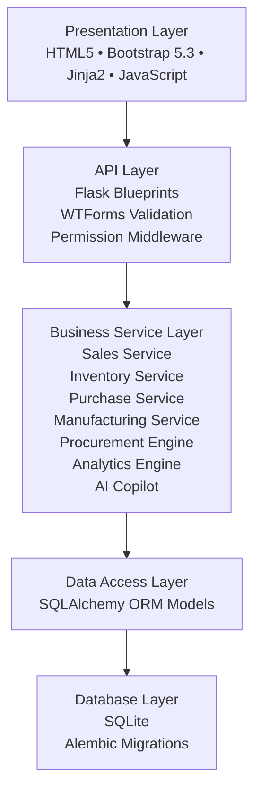

---

# 2. Component Architecture

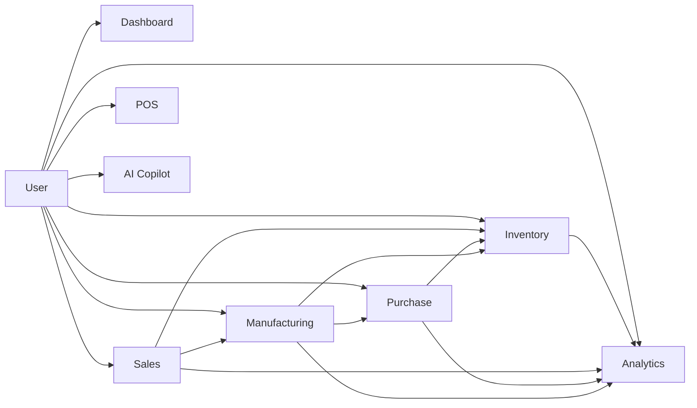

---

# 3. Folder Structure

```text
app/
│
├── extensions/
│   ├── db.py
│   ├── login_manager.py
│   ├── bcrypt.py
│   └── socketio.py
│
├── models/
│   ├── user.py
│   ├── role.py
│   ├── permission.py
│   ├── product.py
│   ├── inventory.py
│   ├── stock_ledger.py
│   ├── sales_order.py
│   ├── purchase_order.py
│   ├── bom.py
│   ├── manufacturing_order.py
│   └── audit_log.py
│
├── routes/
│   ├── auth/
│   ├── dashboard/
│   ├── inventory/
│   ├── sales/
│   ├── purchase/
│   ├── manufacturing/
│   ├── reports/
│   ├── pos/
│   └── ai/
│
├── services/
│   ├── auth/
│   ├── inventory/
│   ├── sales/
│   ├── purchase/
│   ├── manufacturing/
│   ├── procurement/
│   ├── analytics/
│   ├── audit/
│   └── ai/
│
├── templates/
├── static/
├── utils/
├── migrations/
└── seed/
```

---

# 4. Database Entity Relationship Diagram

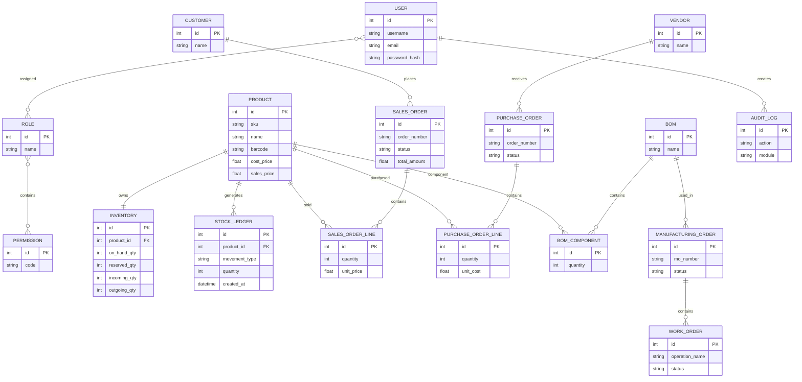

---

# 5. Demand-to-Delivery Workflow

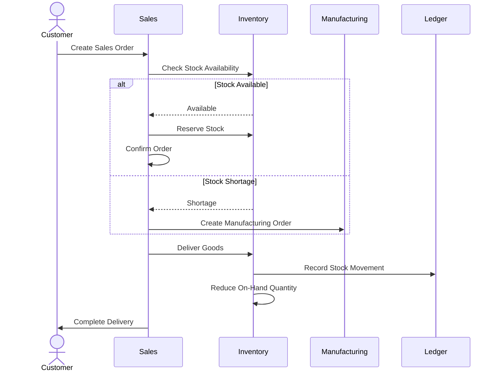

---

# 6. Smart Procurement Workflow

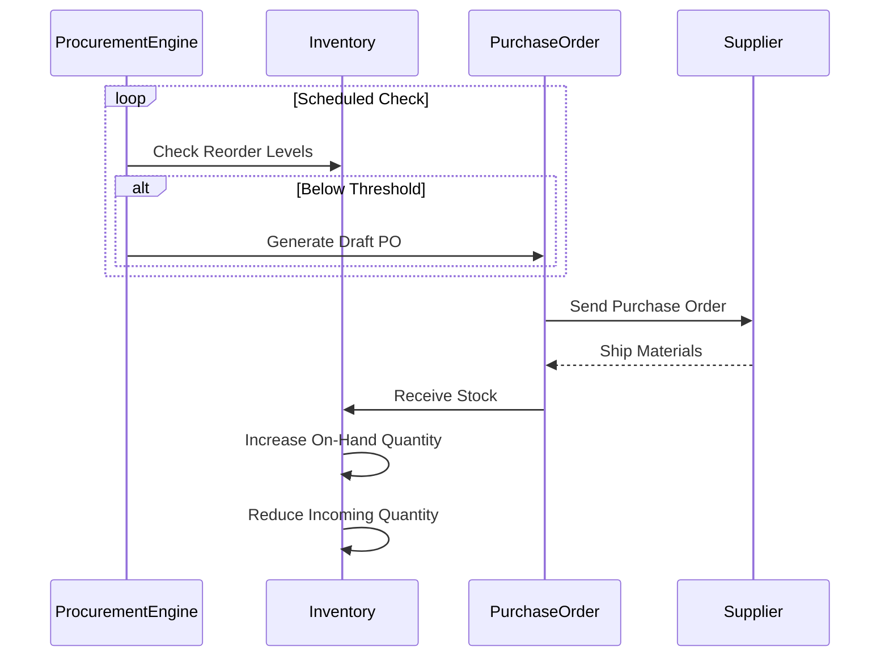

---

# 7. Manufacturing Workflow

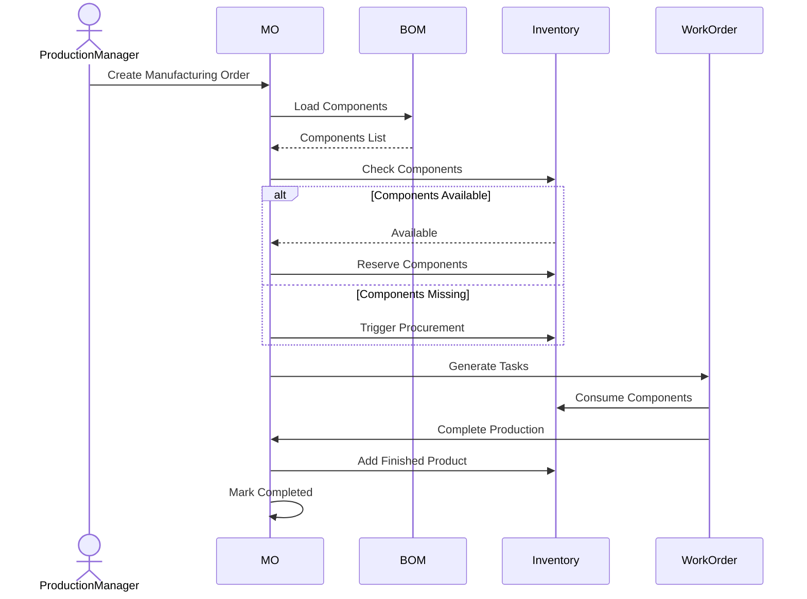

---

# 8. Inventory Movement Architecture

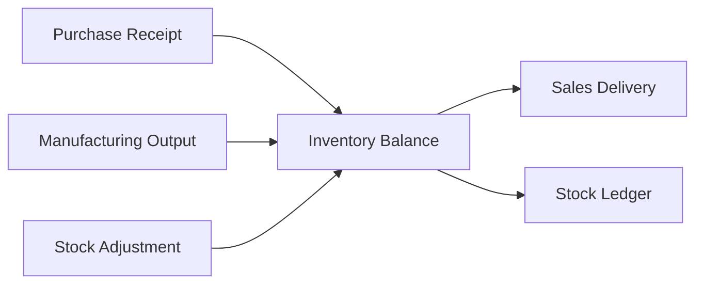

---

# 9. Role-Based Access Control (RBAC)

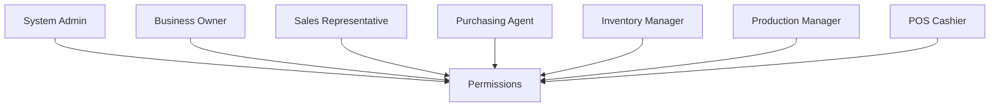

---

# 10. Audit Logging Architecture

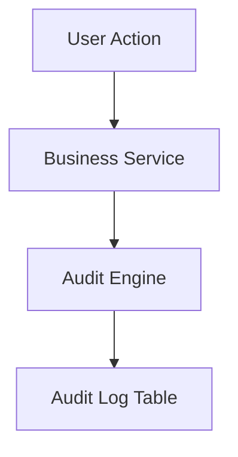

---

# 11. AI Copilot Architecture

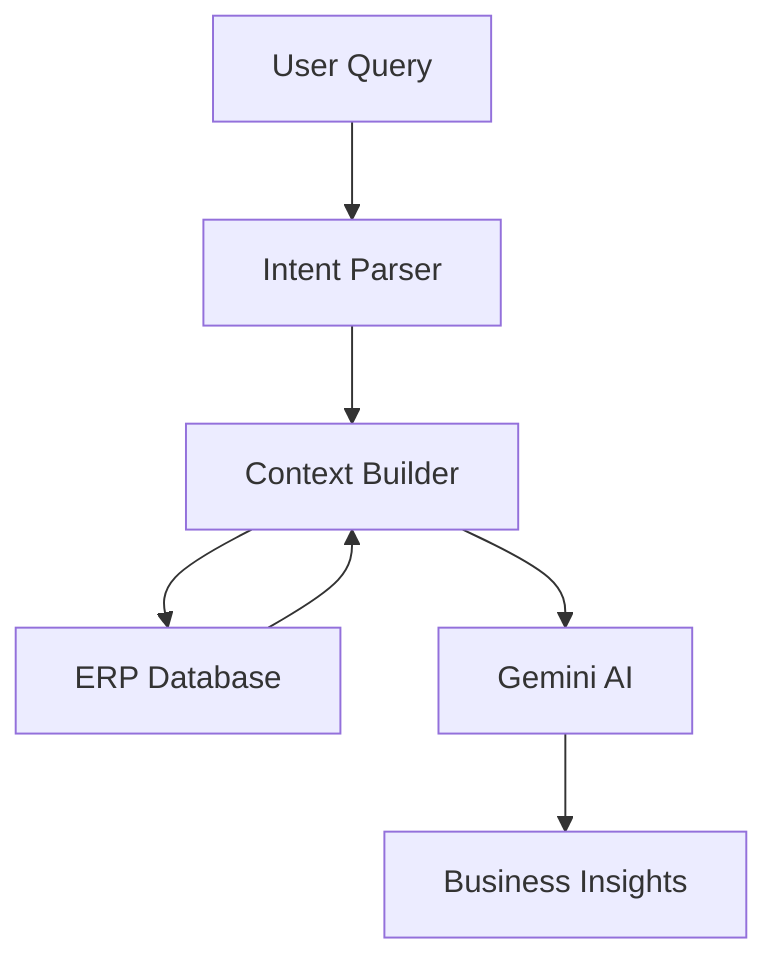

---

# 12. Complete Module Interaction Diagram

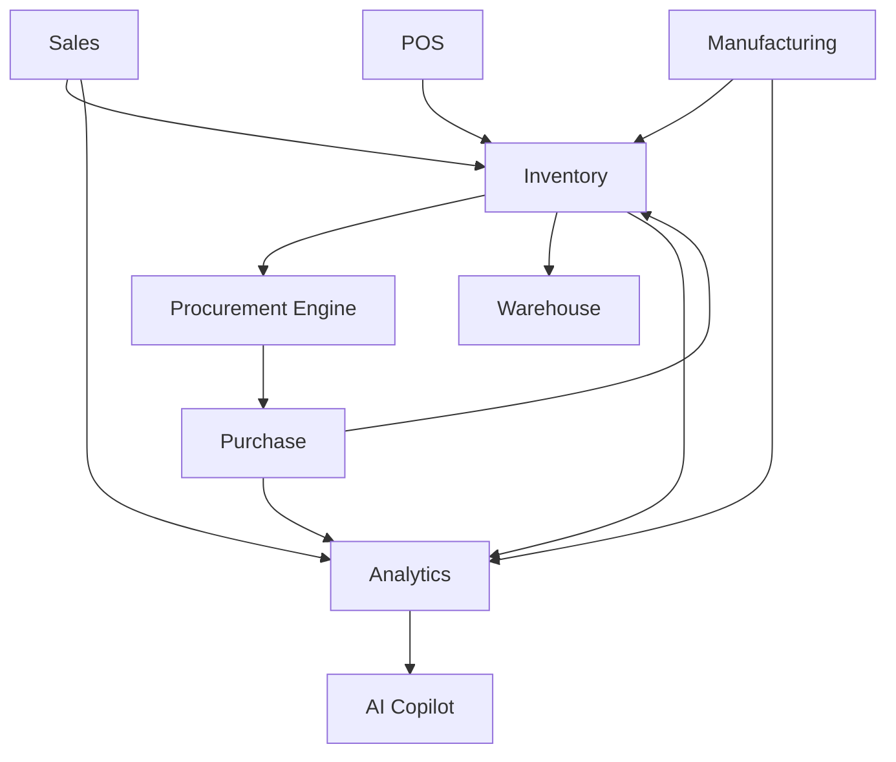
